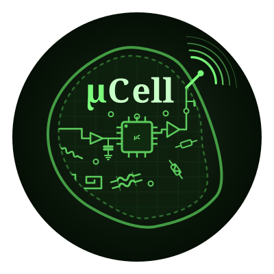
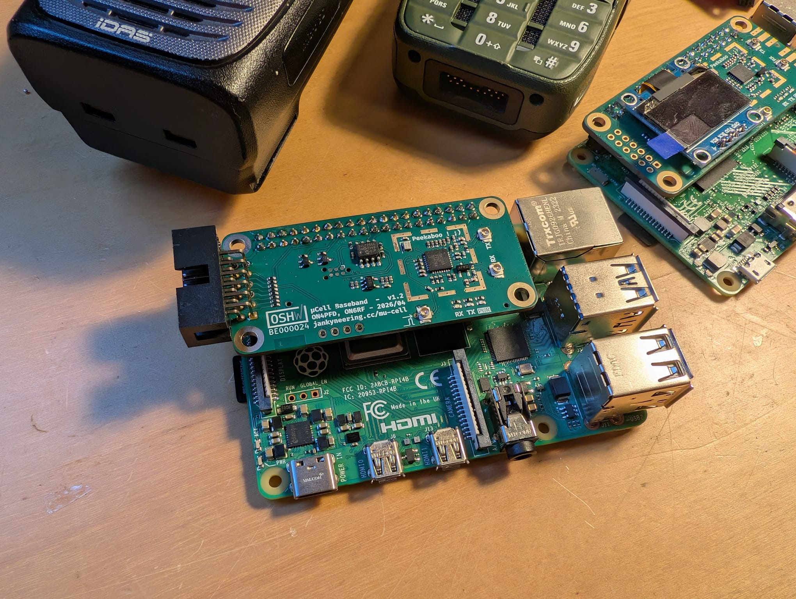
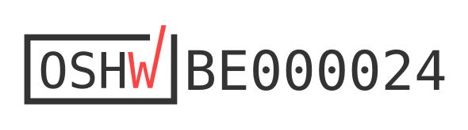

<h1 align="center">µCell</h1>

	

An open-source SDR base station platform for digital and analog voice modes.

Got a board? Start with the [Quick Start Guide](docs/quickStartGuide.md).

---

## Contents

- [What is µCell?](#what-is-µcell)
- [Where to Buy](#where-to-buy)
- [Build Your Own](#build-your-own)
- [How the Software Fits Together](#how-the-software-fits-together)
- [Documentation](#documentation)
- [How to Contribute](#how-to-contribute)
- [Acknowledgements & License](#acknowledgements--license)

---

## What is µCell?

µCell is a software-defined radio base station/repeater/transceiver that runs on a Raspberry Pi.

The µCell BB board puts an SX1255 transceiver, its RF front-end, and a HAT identification EEPROM on a board that sits on a Pi 3, 4, 5, or Zero 2W. A single command installs the driver, and from there you pick the radio software you want to run.

The board presents itself as a standard SoapySDR device. The project started with TETRA, but DMR, D-Star, YSF, P25, and analog FM run on the same board through MMDVM-IQ, and general-purpose SDR software works with it directly. The goal is to support every voice mode we can reach.

Everything is open. Schematics, PCB layouts, production outputs, 3D printed case designs, drivers, and the EEPROM tooling are all in this repository, under licences that let you build, modify, and sell your own.

  

---

## Where to Buy

Assembled and tested µCell BB boards are sold by Fred Corp., one half of the Jankyneering team:

[store.fredcorp.cc](http://store.fredcorp.cc/)

Each board sold there is individually measured on an RF test set before shipping, and carries a signed EEPROM so the driver can confirm where it came from. See the [FAQ](docs/faq.md) for what signing does and does not mean.

---

## Build Your Own

The design is open and the production outputs are in this repository, ready to upload to a PCBA house. Component choice is critical: the RF path depends on inductor Q, capacitor dielectric, and a low drift referenceL. Foregoing proper part selection will affect sensitivity and output power.

See [docs/muCellBBManufacture.md](docs/muCellBBManufacture.md) for the production package contents, the stackup, the component selection notes, and the EEPROM writing procedure.

---

## Software structure

The stack has three layers.

### 1. µCell BB drivers

[mu-cell-bb-drivers](https://github.com/Jankyneering/mu-cell-bb-drivers) contains the device tree overlay that makes the Pi recognise the board, and `SoapyMuCell`, the hardware driver itself. The install script in this repository builds and installs both.

### 2. SoapySDR

`SoapyMuCell` registers with SoapySDR as the device `driver=mucell`. Any SoapySDR-aware application can open the board without knowing anything about the SX1255. This is the integration point: adding support for new software is usually a matter of pointing it at the right device string.

### 3. Applications

| Software | Modes | Status |
|---|---|---|
| [Flowstation](https://github.com/razvanzeces/flowstation) | TETRA, wider feature set, less stable | Supported |
| [Tetra-Bluestation](https://github.com/MidnightBlueLabs/tetra-bluestation) | TETRA, stable, fewer features | Supported on the testing branch, landing in main |
| [MMDVM-IQ](https://github.com/g4klx/MMDVM-IQ) | FM, DMR, D-Star, YSF, P25, POCSAG | Supported |

<!-- TODO: confirm the Bluestation branch wording, and whether MMDVM-IQ is "in progress" or already usable -->

Each of these is its own project with its own installation instructions. General-purpose SDR software such as GQRX, SDR++, or GNU Radio also works with the board. The [quick start guide](docs/quickStartGuide.md) links to each one.

---

## Documentation

| Document | Covers |
|---|---|
| [Quick Start Guide](docs/quickStartGuide.md) | Flash a Pi, install the driver, set up your radio software, get on air |
| [Building the Drivers](docs/buildDriver.md) | The driver and overlay built by hand, step by step, no scripts |
| [Hardware](docs/hardware.md) | Board specifications, connectors, measured performance, cases, roadmap |
| [Manufacturing](docs/muCellBBManufacture.md) | Production outputs, component selection, EEPROM writing and signing |
| [FAQ](docs/faq.md) | Common questions, support routes, the "not genuine" warning |

---

## How to Contribute

Contributions are welcome. For small fixes or documentation updates, feel free to open a pull request directly. For larger changes, open an issue first so the approach can be discussed. Keep pull requests focused and include a clear description of what changed and why.

Hardware contributions follow the same route. If you are proposing a layout or component change, include the reasoning and, where relevant, the measurements that back it up.

Support for a new mode or a new piece of SDR software is always of interest. If you get something working against `driver=mucell`, a short section for the quick start guide is a welcome contribution on its own.

---

## Acknowledgements & License

µCell builds on the work of several open-source projects:

- Tatu Peltola ([tejeez](https://github.com/tejeez/)), designer of the [SXCeiver](https://github.com/tejeez/sxxcvr), which provided early inspiration for compact SX1255-based SDR hardware.
- Wouter Bokslag ([Midnight Blue](https://github.com/MidnightBlueLabs/)) and contributors, authors of [TETRA-bluestation](https://github.com/MidnightBlueLabs/tetra-bluestation), which implements an open TETRA base station stack.

We also acknowledge the broader SDR and SoapySDR communities whose work enables hardware experimentation with modern radio systems.

Certified open source hardware by OSHWA under registration BE000024

<!-- TODO: download the certification mark with the UID from the project page at certification.oshwa.org/be000024.html and commit it to docs/logos/. The link above assumes oshw-be000024.svg. -->

Hardware and documentation published under CreativeCommons BY-SA 4.0

[Creative Commons Attribution-ShareAlike 4.0 International License](http://creativecommons.org/licenses/by-sa/4.0/)

Software published under GNU GPLv3

[GNU GPLv3](https://www.gnu.org/licenses/gpl-3.0.en.html)
